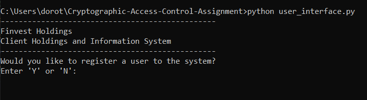

# Cryptographic-Access-Control-Assignment
#### SYSC 4810 Fall 2023 Assignment

## DESCRIPTION
The Finvest Holdings User Authentication & Access Control System for proprietary financial software and data systems is a secure system that allows users to enroll and login into a secure system to access financial instruments based on your role.

## USAGE
#### Program Compilation
This program can be executed by these following steps:

### Running the user interface file
1. Open the command prompt or terminal on your environment.
2. Navigate to the project using the command 'cd' to the correct directory.
3. On the command line, type:
```
> python user_interface.py
```

## RESULTS
After compiling the user_interface.py file, the command line should prompt you to register a user or not.
